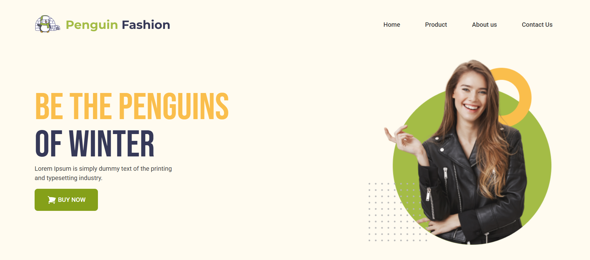
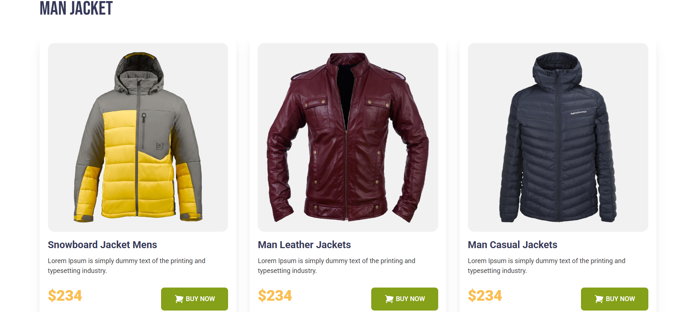

# ❄️ Winter Shop – Jacket Landing Page

**Winter Shop** is a responsive winter jacket landing page built using **HTML** and **Tailwind CSS**. The page showcases stylish men’s and women’s jackets for the cold season and includes key sections like product categories, delivery info, and more.

[🔗 Live Demo](https://devo-ab.github.io/winter-shop)

---

## 🛠️ Tech Stack

- **HTML5**
- **Tailwind CSS**

---

## 🌟 Features

- ✅ Responsive design for all devices
- ✅ Clean header and navigation bar
- ✅ Eye-catching banner
- ✅ Women's Jacket Showcase
- ✅ Men's Jacket Showcase
- ✅ Delivery & Shipping Information
- ✅ Footer with essential links

---

---

## 📁 Folder Structure

```
winter-shop/
├── assets/
│   ├── icons/              # Icon assets
│   ├── images/             # Website images
│   ├── logo/               # Logo files
├── preview/                # Screenshots for README
├── index.html              # Main landing page
└── README.md               # Project documentation
└── tailwind.config.js      # Tailwind config
```

---

## 🖼️ Screenshots

### 🧭 Hero Banner & Navbar



### 🚲 Latest Jackets



### 👣 Full page preview


---

## 📲 How to Use Locally

1. **Clone the repo**
   ```bash
   git clone https://github.com/devo-ab/winter-shop.git
   cd winter-shop
   ```

# 👤 Author

# Avi Jit

## :mailbox: Reach me out

<p align="left">
<a href="https://linkedin.com/in/itsavijitb" target="blank"></a>
<a href="https://twitter.com/itsavijitb" target="blank"></a>
<a href="https://facebook.com/itsavijitb" target="blank"></a>
<a href="https://instagram.com/itsavijitb" target="blank"></a>
</p>
